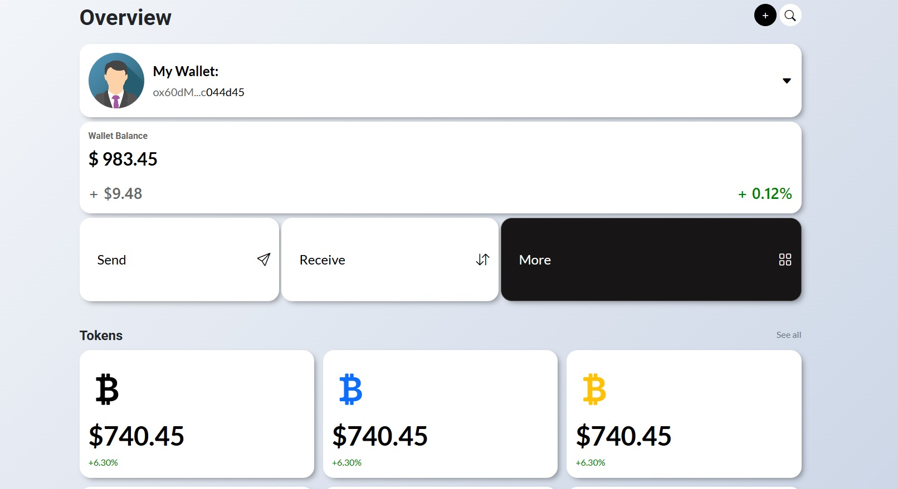
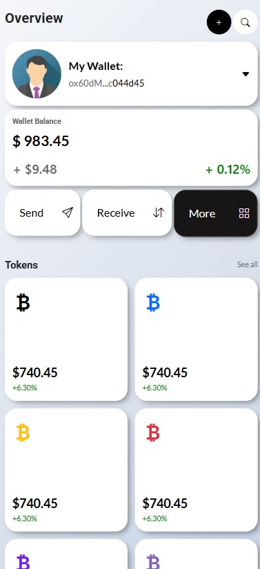

# 💰 SmartBudget - Wallet de Finanzas Personales


> Aplicación web responsive para visualizar y gestionar finanzas personales de forma intuitiva.

## 🌐 Demo en Vivo

**Deploy:** [https://nicolasparadaa.github.io/m3_abp_proyecto/](https://nicolasparadaa.github.io/m3_abp_proyecto/)

## 📋 Descripción del Proyecto

SmartBudget es una interfaz web funcional desarrollada como proyecto de evaluación del **Módulo 3: Desarrollo de la Interfaz de Usuario Web**. La aplicación permite a los usuarios visualizar su billetera de criptomonedas, balance total, tokens y realizar operaciones básicas de envío y recepción.

El proyecto implementa las mejores prácticas de desarrollo front-end moderno, con una arquitectura modular, escalable y completamente responsive.

## ✨ Características

- 🎨 **Diseño moderno y limpio** basado en principios de UX/UI
- 📱 **100% Responsive** - Compatible con móvil, tablet y desktop
- ⚡ **Animaciones suaves** con transitions y hover effects
- 🎯 **Navegación intuitiva** entre secciones
- 🌙 **Dark mode** en botones y componentes seleccionados
- 🔐 **Interfaz de wallet** con visualización de dirección blockchain

## 🛠️ Tecnologías Utilizadas

### Core Technologies
- **HTML5** - Estructura semántica con etiquetas modernas
- **SCSS/SASS** - Preprocesador CSS con arquitectura 7-1
- **Bootstrap 5** - Framework CSS para componentes y grid system
- **JavaScript** - Funcionalidad de Bootstrap (bundle)

### Metodologías y Patrones
- **BEM (Block Element Modifier)** - Nomenclatura de clases CSS
- **Patrón 7-1** - Organización de archivos SCSS
- **Mobile First** - Diseño adaptativo desde dispositivos móviles
- **Flexbox & Grid** - Sistemas de layout modernos

### Herramientas
- **Git & GitHub** - Control de versiones
- **GitHub Pages** - Despliegue y hosting
- **Visual Studio Code** - Editor de código
- **SASS Compiler** - Compilación de SCSS a CSS

## 📂 Estructura del Proyecto
```
m3_abp_proyecto/
│
├── assets/
│ ├── css/
│ │ └── main.css # CSS compilado
│ ├── img/
│ │ ├── desktop.jpg # Captura desktop
│ │ └── mobile.jpg # Captura mobile
│ └── js/
│ └── bootstrap.bundle.js # Bootstrap JS
│
├── scss/
│ ├── abstracts/
│ │ ├── _index.scss # Exporta abstracts
│ │ ├── _mixins.scss # Mixins reutilizables
│ │ └── _variables.scss # Variables globales
│ ├── base/
│ │ ├── _index.scss
│ │ └── _base.scss # Estilos base (body, html)
│ ├── components/
│ │ ├── _index.scss
│ │ ├── _boxes.scss # Componentes tipo card/box
│ │ ├── _buttons.scss # Botones circulares
│ │ └── _tokens.scss # Cards de tokens
│ ├── layout/
│ │ └── _index.scss
│ ├── pages/
│ │ └── _index.scss
│ ├── themes/
│ │ └── _index.scss
│ ├── vendors/
│ │ └── _index.scss
│ └── main.scss # Archivo principal SASS
│
├── index.html # Página principal (Overview)
├── send.html # Página de envío
├── receive.html # Página de recepción
└── README.md # Documentación del proyecto
```

## 🎨 Metodología BEM

El proyecto utiliza **BEM (Block Element Modifier)** para una nomenclatura clara y escalable:

```scss
// Bloque
.box-profile { }

// Elementos
.box-profile__avatar { }
.box-profile__text { }
.box-profile__title { }
.box-profile__address { }
.box-profile__icon { }

// Modificadores
.box-profile--dark { }

Ventajas implementadas:
✅ Código autodocumentado y fácil de entender

✅ Evita conflictos de especificidad CSS

✅ Facilita el trabajo en equipo

✅ Escalabilidad para proyectos grandes

🎯 Patrón 7-1 con SASS
La arquitectura SCSS sigue el patrón 7-1, organizando los estilos en 7 carpetas y 1 archivo principal:

Carpeta	Propósito
abstracts/	Variables, mixins, funciones (sin CSS generado)
base/	Estilos base del proyecto (reset, tipografía)
components/	Componentes reutilizables (botones, cards, tokens)
layout/	Estructura principal (header, footer, grid)
pages/	Estilos específicos de páginas
themes/	Temas y variaciones de color
vendors/	CSS de terceros (Bootstrap overrides)
main.scss	Archivo que importa todos los parciales
Mixins Destacados
text
// Hover animation para interactividad
@mixin hover-animation($scale: 1.025, $duration: 0.3s) {
    transition: transform $duration ease;
    
    @media (hover: hover) {
        &:hover {
            transform: scale($scale);
        }
    }
}

// Botones con efectos de presionar
@mixin btn-animation {
    @include hover-animation(1.1, 0.3s, ease, transform, pointer);
    
    &:active {
        transform: scale(0.9);
    }
}

📱 Responsive Design
El proyecto es mobile-first y se adapta a diferentes dispositivos:

📱 Mobile: < 768px

📱 Tablet: 768px - 991px

💻 Desktop: ≥ 992px

Media Queries Implementadas
text
// Mobile
@media screen and (min-width: 768px) {
    // Estilos para tablet y desktop
}

// Hover solo en dispositivos con mouse
@media (hover: hover) {
    &:hover {
        // Efectos hover
    }
}

🚀 Cómo Usar el Proyecto
Instalación Local
Clonar el repositorio

bash
git clone https://github.com/NicolasParadaA/m3_abp_proyecto.git
cd m3_abp_proyecto
Abrir con Live Server

Abre index.html con tu editor favorito

Usa Live Server (VSCode) o abre directamente en el navegador

Compilar SCSS
Si modificas archivos SCSS:

bash
# Compilación manual con SASS
sass scss/main.scss assets/css/main.css

# Watch mode (detecta cambios automáticamente)
sass --watch scss/main.scss:assets/css/main.css

# Script automatico sass
npm run sass

🎓 Justificación de Decisiones Técnicas
¿Por qué BEM?
Nomenclatura clara que refleja la estructura HTML

Evita problemas de cascada y especificidad

Facilita la reutilización de componentes

Estándar de la industria para proyectos escalables

¿Por qué Patrón 7-1?
Organización modular y profesional

Separación clara de responsabilidades

Fácil mantenimiento y escalabilidad

Facilita el trabajo colaborativo

¿Por qué Bootstrap 5?
Grid system flexible y responsive

Componentes preconstruidos (botones, cards)

Clases utilitarias que aceleran el desarrollo

Compatibilidad cross-browser garantizada

Actualización de Bootstrap 4 (requisito original) para mejoras de rendimiento

¿Por qué Media Query (hover: hover)?
Previene sticky hover en dispositivos táctiles

Mejora la experiencia de usuario en móviles

Evita comportamientos inesperados del CSS

Práctica moderna recomendada por MDN

📸 Capturas de Pantalla

*Interfaz principal mostrando wallet balance y tokens*


*Diseño adaptativo para dispositivos móviles*

👨‍💻 Autor
Nicolás Parada A.

GitHub: @NicolasParadaA

Proyecto: 
m3_abp_proyecto

📝 Licencia
Este proyecto fue desarrollado como parte del Módulo 3: Desarrollo de la Interfaz de Usuario Web - Bootcamp SENCE.

⭐ Si te gustó este proyecto, no olvides darle una estrella en GitHub.